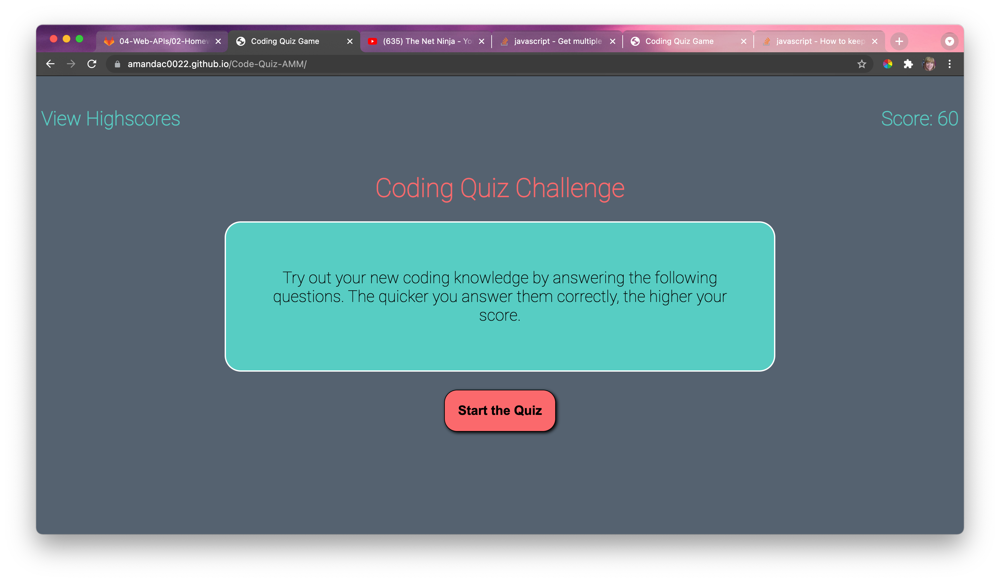

# Code-Quiz-AMM
## Description 
This project's goal was to create a timed Code Quiz. When you open the webpage, the user is given a brief set of instructions as to how to play the game. When the user clicks start, the user is presented with a question. If the user answers correctly, then 20 points is added to you score and you move onto the next question. If the user answer wrongly, a message will display and 5 points will be deducted from your score. Once you have completed the game, you can save your score and initials to be displayed on the scores letterboard. At any time, you may click the View Highscores button and it will allow you to see the previous highscore. 
## Link to Deployed Webpage:
https://amandac0022.github.io/Code-Quiz-AMM/

## Github Repo Link:
https://github.com/AmandaC0022/Code-Quiz-AMM

## Screenshot of Deployed Webpage:
  